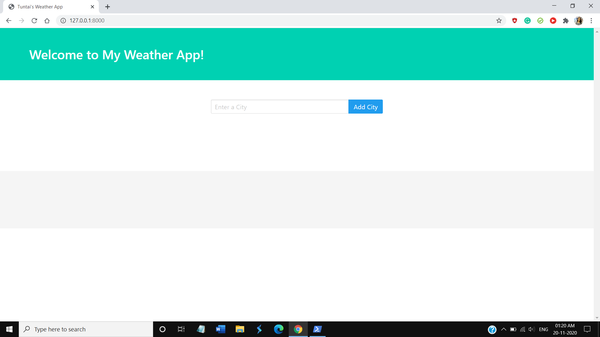
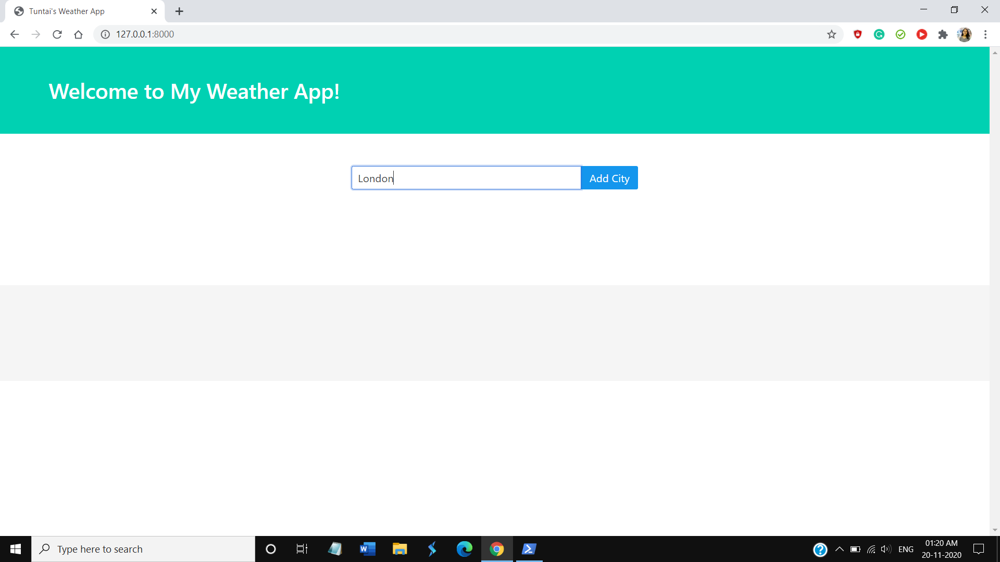
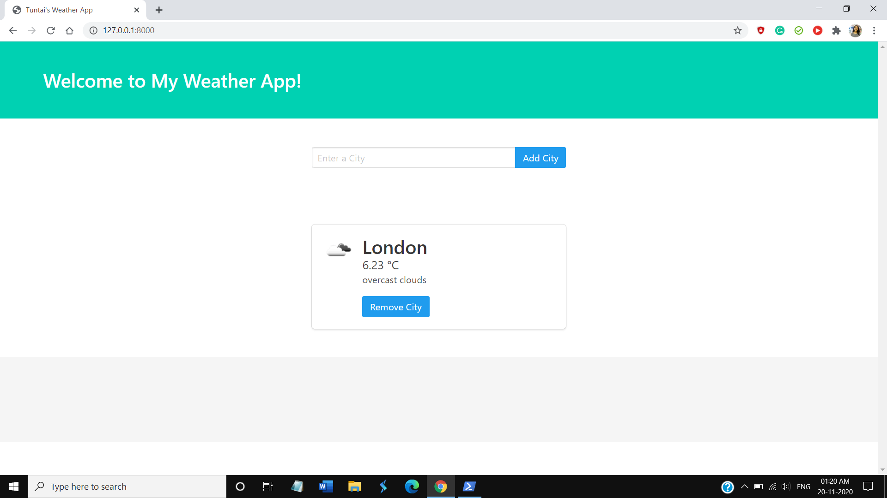
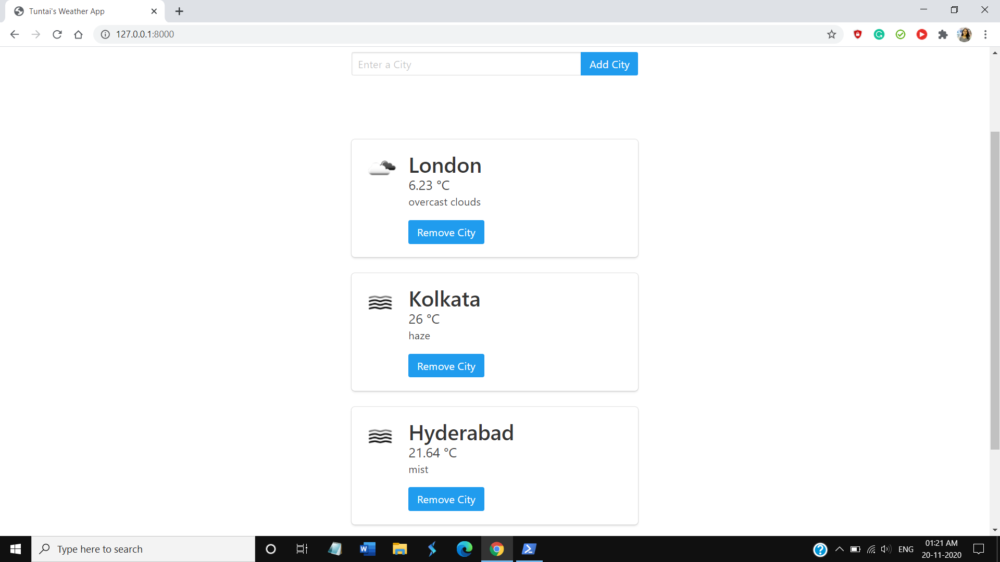

# WeatherApp
It is a Django app which uses the "Open Weather Map" API and shows the user weather information of the cities they choose. A user can add as many cities as they want and can also remove cities from the list!

## Samples 






## To run this web-app in your local systems:

### 1. Pre-requisites:
1. Python 3
2. pip 3
3. Django (Any version will work)
### 2. Clone this Repo :
```sh
git clone https://github.com/Tuntai/WeatherApp.git
cd Topic-Tracker-Model
```
You can also download the folder and extract all the files in your local system.
### 3. Apply migrations : 
```sh
python manage.py makemigrations
python manage.py migrate
```
### 4. Run server:
```sh
python manage.py runserver
```

#### Change the categories according to your preferences by creating a superuser 
```sh
python manage.py createsuperuser
```
